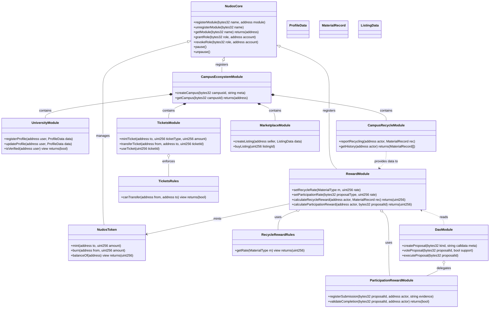

# NUDOS — UML profesional y Estructura de carpetas Solidity

Este documento contiene:

1. Diagrama UML (clases y relaciones) en formato técnico y profesional.
2. Diagramas de secuencia clave (reciclaje → recompensa; propuesta DAO → recompensa).
3. Estructura de carpetas recomendada para los contratos Solidity, scripts y tests.

---

## 1) UML — Diagramas de Clases y Relaciones (profesional)

> **Notas**: El UML está diseñado para auditores y desarrolladores. Muestra contratos como clases, sus funciones públicas relevantes, roles y relaciones (dependencia / composición / herencia).

